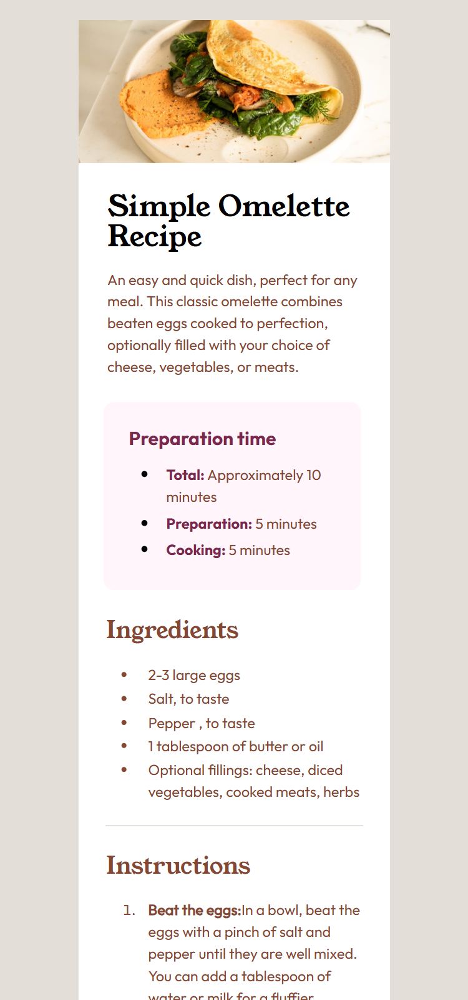

# Frontend Mentor - recipe-page-main

This is a solution to the [recipe-page-main on Frontend Mentor]. Frontend Mentor challenges help you improve your coding skills by building realistic projects. 

### Preview on screen 375px

### Preview on screen 1440px

### Links

- Solution URL: [https://github.com/handipo2022/recipe-page-main](https://github.com/handipo2022/recipe-page-main)
- Live Site URL: [https://handipo2022.github.io/recipe-page-main/](https://handipo2022.github.io/recipe-page-main/)

### Built with

- Semantic HTML5 markup
- CSS custom properties
- Flexbox
- CSS Grid
- Mobile-first workflow

## Author

- Frontend Mentor - [@handipo2022](https://www.frontendmentor.io/profile/handipo2022)
